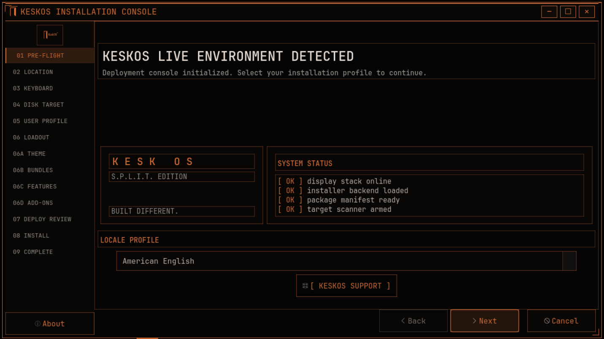
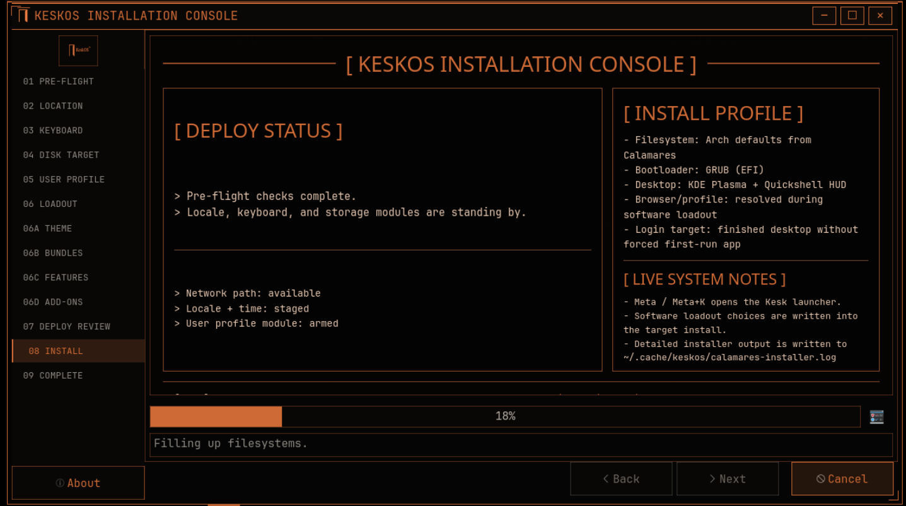

# KeskOS

<p align="center">
  
</p>

<p align="center">
  <strong>Legacy systems. Modern workflows.</strong><br>
  An Arch-based KDE Plasma operating system with a dark industrial console style, a patched KDE Plasma launcher, and a fully themed live installer.
</p>

> BETA BRANCH: DO NOT USE. TESTING ONLY.
>
> Current active beta work for KeskOS now lives on the `beta-development` branch.

## Websites

- Main website: [keskos.org](https://keskos.org)
- Downloads: [download.keskos.org](https://download.keskos.org)
- Source and release mirror: [GitHub](https://github.com/memegeko/keskos)

## Current Release

Primary download:

- [download.keskos.org](https://download.keskos.org)

Main website:

- [keskos.org](https://keskos.org)

GitHub mirror and release notes:

- [GitHub Releases](https://github.com/memegeko/keskos/releases)

### Using the Download
- the Download on keskos.org gives you `keskos // layer x`
- flash that `.iso` with `Rufus`, `balenaEtcher`, or `Ventoy`

## About KeskOS

`KeskOS` is a full live operating system built on Arch Linux. It boots straight into a usable KDE Plasma desktop, carries its own visual identity from boot to login to installer to desktop, and installs through a custom-themed Calamares workflow.

It is meant to feel like a complete product instead of a loose rice script:

- a real live ISO you can boot and test before installing
- a dark industrial orange-on-black desktop style
- a patched `Kesk Kickoff` launcher integrated into Plasma
- a branded KeskOS default bottom panel with launcher, pinned apps, and workspace switching
- a themed terminal, browser home page, login stack, lock screen, splash screen, and installer
- a custom window decoration theme built for the rest of the OS look
- a desktop that stays visually consistent across the live session and installed system

Project planning and active work are tracked in:

- [ROADMAP.md](ROADMAP.md)
- [docs/repository-structure.md](docs/repository-structure.md)
- [docs/launcher-switching.md](docs/launcher-switching.md)
- [docs/plasma-panel-layout.md](docs/plasma-panel-layout.md)
- [docs/keybinds.md](docs/keybinds.md)
- [docs/website-content/README.md](docs/website-content/README.md)

## Main Features

### Live ISO

Booting the ISO gives you a real live desktop session with:

- KDE Plasma
- autologin into the live environment
- working launcher, browser, terminal, and file manager
- `Install KeskOS` desktop shortcut and menu entry
- preloaded branding and theme assets

### Installer

KeskOS installs through Calamares with a custom visual style and standard guided flow:

- Welcome
- Location
- Keyboard
- Partitions
- Users
- Software loadout
- Deploy review
- Install
- Finish

### Desktop Experience

The installed system carries over the visual identity:

- custom orange console look
- patched `Kesk Kickoff` launcher with KeskOS branding
- branded bottom panel with launcher, pinned apps, and workspace switcher
- custom Konsole profile
- custom browser home page
- browser selection during install
- prefilled username on the first login screen after install
- custom login / lock / splash stack

## Screenshots

### Desktop and Apps

<p align="center">
  
</p>

<p align="center">
  
</p>

<p align="center">
  
</p>

<p align="center">
  
</p>

<p align="center">
  
</p>

<p align="center">
  
</p>

<p align="center">
  
</p>

### Installer Flow

<p align="center">
  
</p>

<p align="center">
  
</p>

## Installing KeskOS

1. Download the latest release from [download.keskos.org](https://download.keskos.org).
2. Extract the ISO:

```bash
unzstd keskos-2026.05.01-x86_64.iso.zst
```

3. Write the extracted `.iso` to a USB drive with your preferred flashing tool.
4. Boot the machine from that USB drive.
5. Test the live desktop if you want.
6. Open `Install KeskOS`.
7. Follow the Calamares installer.

Recommended VM settings for testing:

- `4 GB` RAM or more
- `4` vCPUs if available
- `32 GB` virtual disk or more
- UEFI firmware if you want to test the EFI path

## Included Components

KeskOS currently ships with these major pieces:

- Arch Linux base
- KDE Plasma desktop
- Calamares installer
- patched `Kesk Kickoff` launcher
- KeskOS default panel layout template and reset tooling
- Konsole
- Dolphin
- browser selection flow for LibreWolf, Zen Browser, or Brave
- custom SDDM, lock screen, and splash
- custom wallpaper, HUD, and branding assets

## Release Notes for 2026.05.01

This ISO line includes:

- a real live desktop instead of the old script-only setup path
- a themed Calamares installer
- installer-time browser and software loadout selection
- a seam-free custom window decoration path
- launcher, browser, files, and terminal wired into the live session
- post-install user defaults and first-login polish
- branded login, lock screen, splash, and browser home

## Branches

The repo keeps both the stable project line and the active beta development line available.

Branches:

- `beta-development`
  - the current active beta branch for in-progress installer, updater, and desktop integration work
- `main`
  - the mainline branch
- `legacy-script-installer`
  - the original script-based installer work

If you want the newest beta work first, use:

```bash
git checkout beta-development
```

Switch branches with:

```bash
git checkout legacy-script-installer
```

and:

```bash
git checkout main
```
