# KeskOS

<p align="center">
  
</p>

<p align="center">
  <strong>Legacy systems. Modern workflows.</strong><br>
  An Arch-based KDE Plasma operating system with a dark industrial console style, a custom command launcher, and a fully themed live installer.
</p>

## Current Release

The current ISO release asset is:

- `keskos-2026.05.01-x86_64.iso`
- Size: about `2.1 GB`
- SHA-256:

```text
77152eeb7de570492c5ae875a9d4c41470ecea674dd5c316219491961a5940f8
```

Download it from:

- [GitHub Releases](https://github.com/memegeko/keskos/releases)

## What KeskOS Is

`KeskOS` is a real bootable live ISO built on Arch Linux. It boots into a ready-to-use KDE Plasma desktop, includes a custom visual identity from boot to login to desktop, and installs through a themed Calamares GUI installer.

It is designed to feel like a complete operating system rather than a loose rice script:

- custom `KeskOS` desktop wallpaper and HUD
- custom window decoration theme
- dark orange-on-black Plasma styling
- custom launcher built around the `KESK` command layer
- themed Konsole with `fastfetch`
- themed browser start page
- themed SDDM login, lock screen, and splash
- live installer experience with `Calamares`
- live ISO desktop that is usable before install

## Main Features

### Live ISO

Booting the ISO gives you a real live desktop session with:

- KDE Plasma
- autologin into the live environment
- working launcher, browser, terminal, and file manager
- `Install KeskOS` desktop shortcut and menu entry
- preloaded branding and theme assets

### Installer

KeskOS installs through Calamares with a custom visual style and standard guided flow:

- Welcome
- Location
- Keyboard
- Partitions
- Users
- Summary
- Install
- Finish

### Desktop Experience

The installed system carries over the visual identity:

- custom orange console look
- `KESK` launcher shortcuts
- custom Konsole profile
- custom browser home page
- prefilled username on the first login screen after install
- custom login / lock / splash stack

## Screenshots

### Desktop and Apps

<p align="center">
  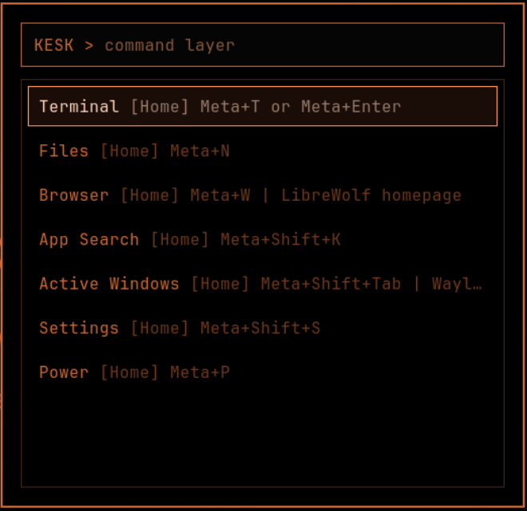
</p>

<p align="center">
  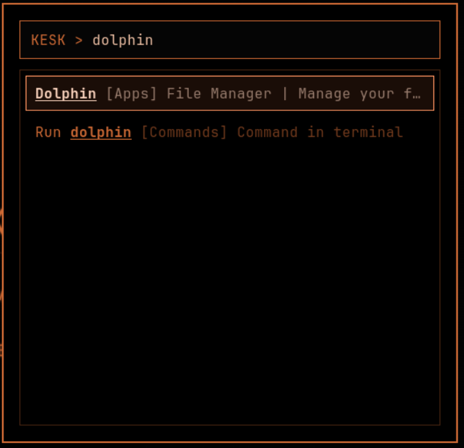
</p>

<p align="center">
  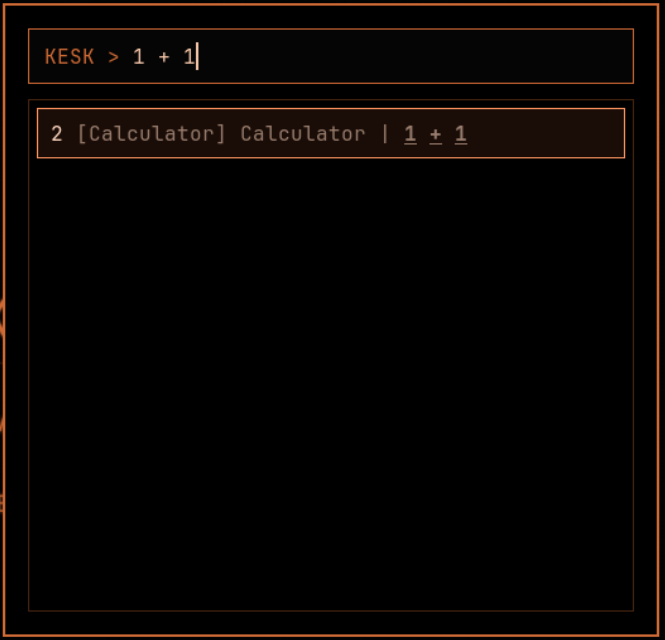
</p>

<p align="center">
  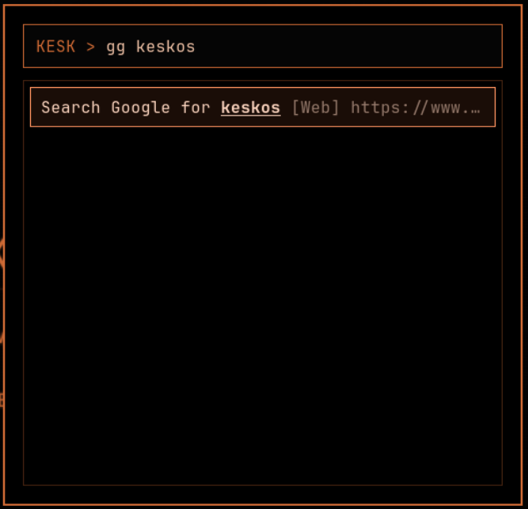
</p>

<p align="center">
  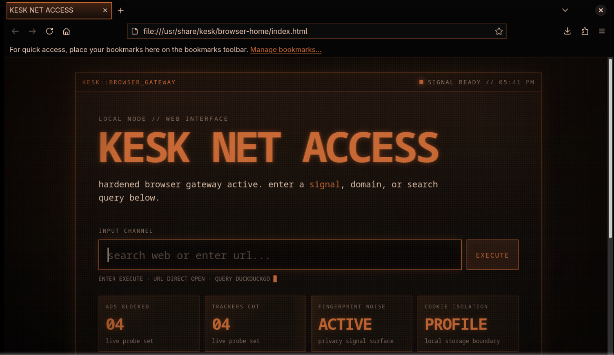
</p>

<p align="center">
  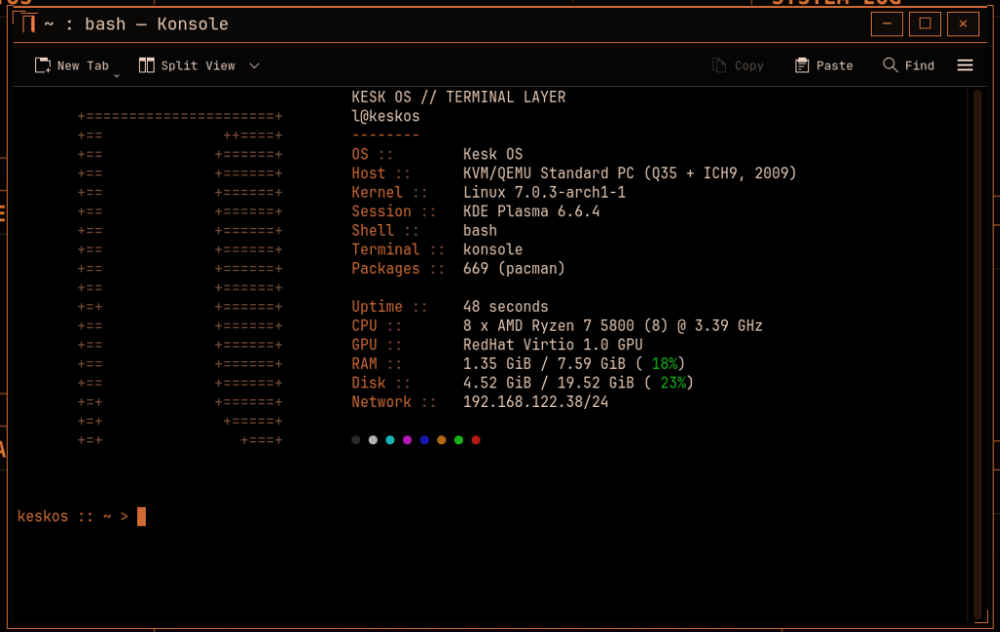
</p>

<p align="center">
  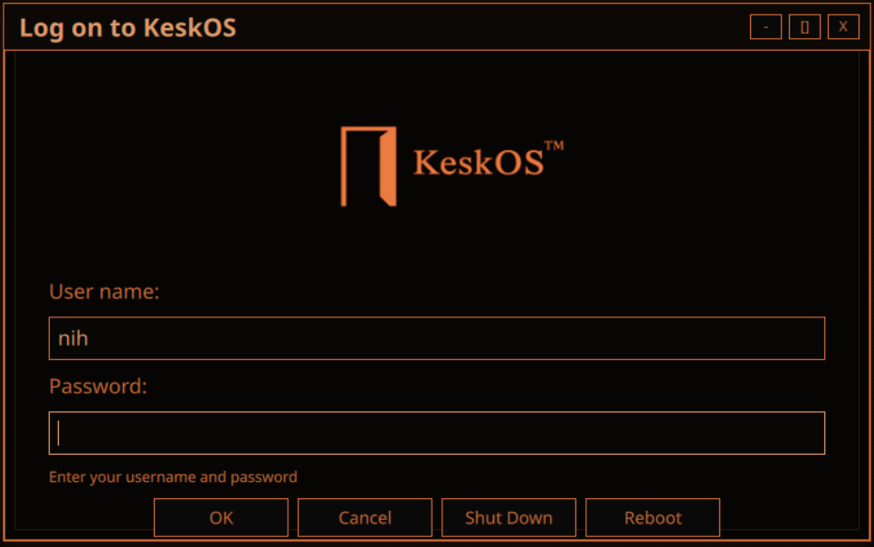
</p>

### Installer Flow

<p align="center">
  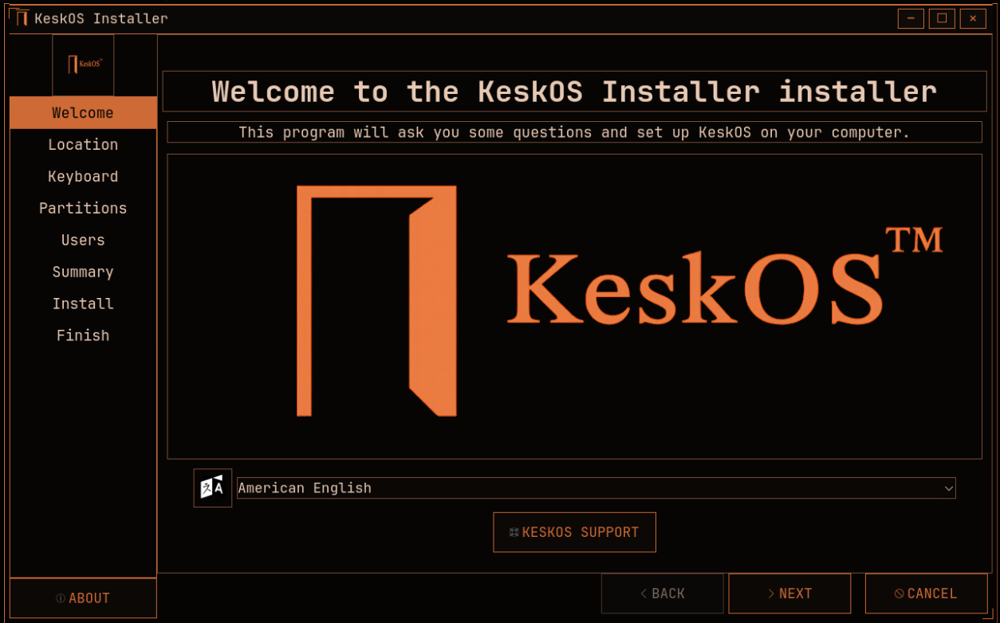
</p>

<p align="center">
  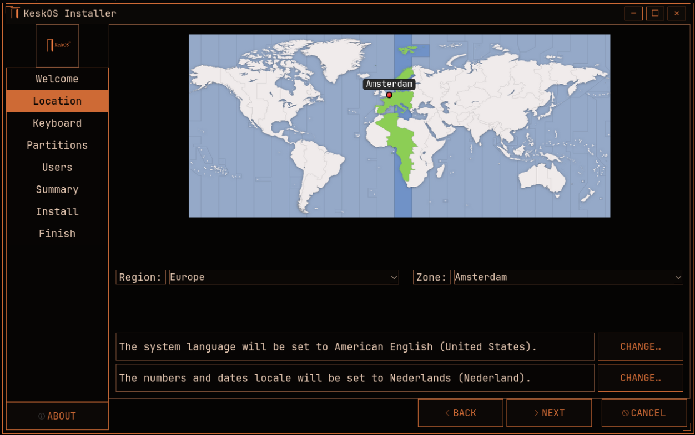
</p>

<p align="center">
  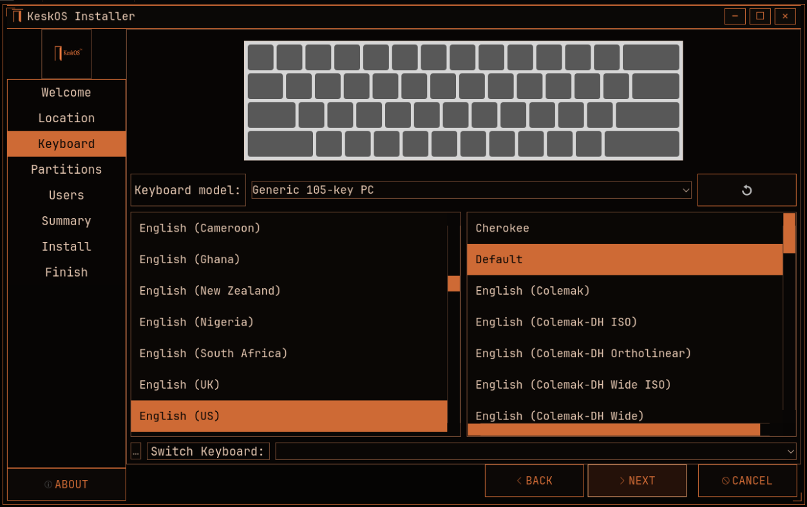
</p>

<p align="center">
  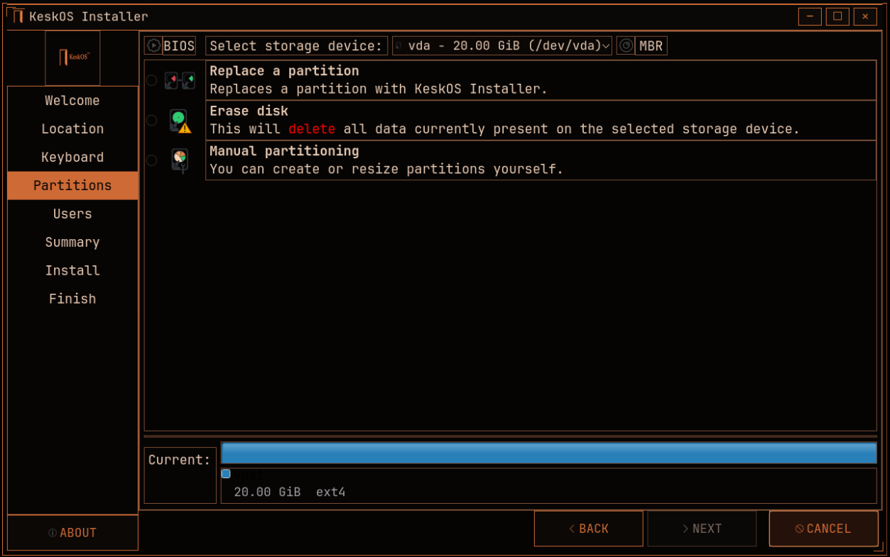
</p>

<p align="center">
  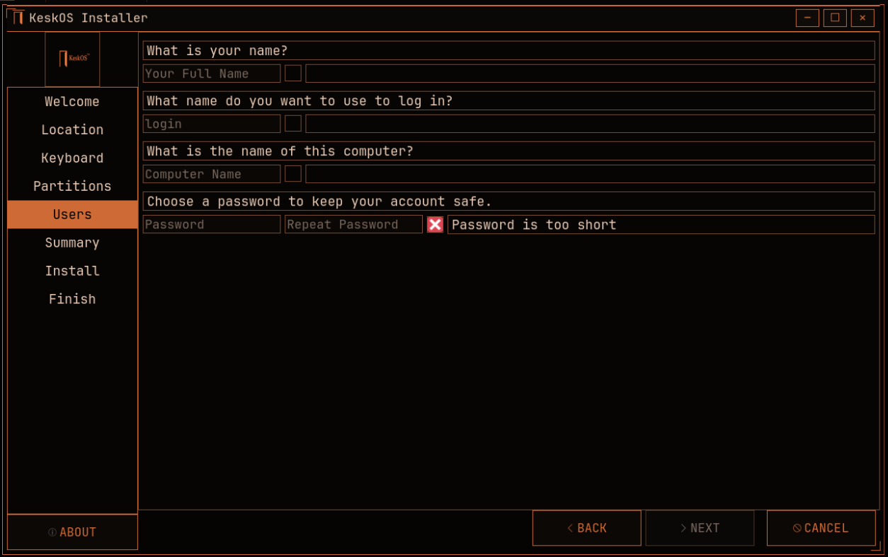
</p>

<p align="center">
  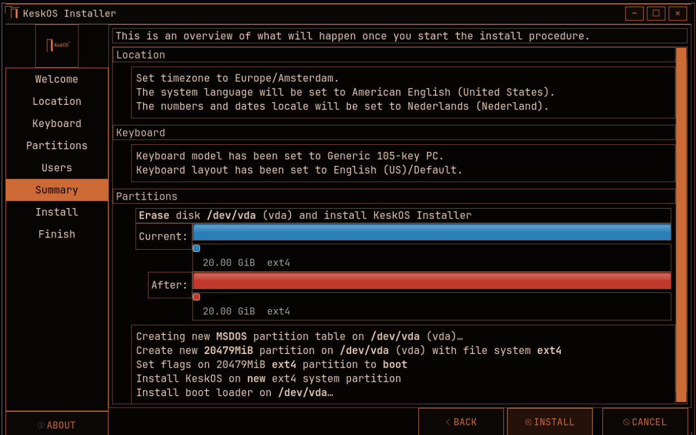
</p>

<p align="center">
  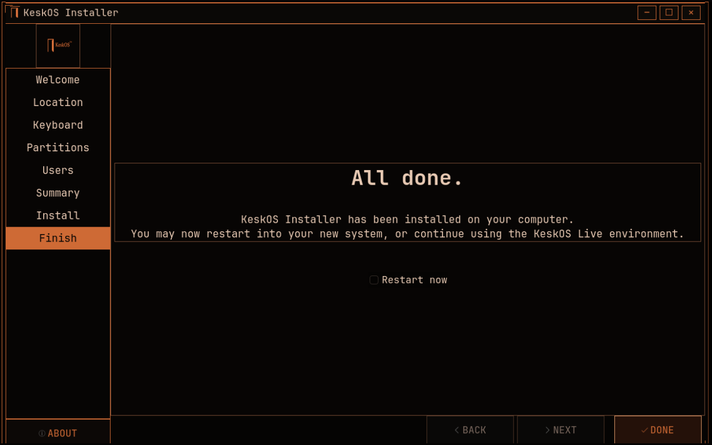
</p>

## Installing KeskOS

1. Download the latest ISO from [Releases](https://github.com/memegeko/keskos/releases).
2. Write it to a USB drive with your preferred flashing tool.
3. Boot the machine from that USB drive.
4. Test the live desktop if you want.
5. Open `Install KeskOS`.
6. Follow the Calamares installer.

Recommended VM settings for testing:

- `4 GB` RAM or more
- `4` vCPUs if available
- `32 GB` virtual disk or more
- UEFI firmware if you want to test the EFI path

## Included Components

KeskOS currently ships with these major pieces:

- Arch Linux base
- KDE Plasma desktop
- Calamares installer
- `rofi`-based `KESK` launcher
- Konsole
- Dolphin
- Firefox / browser integration for the live environment
- custom SDDM, lock screen, and splash
- custom wallpaper, HUD, and branding assets

## Release Notes for 2026.05.01

This ISO line includes:

- a real live desktop instead of the old script-only setup path
- a themed Calamares installer
- a seam-free custom window decoration path
- launcher, browser, files, and terminal wired into the live session
- post-install user defaults and first-login polish
- branded login, lock screen, splash, and browser home

## Source and Legacy Branch

The repo still keeps the old script installer work safely preserved.

Branches:

- `main`
  - the current Archiso + Calamares ISO project
- `legacy-script-installer`
  - the original script-based installer work

Switch branches with:

```bash
git checkout legacy-script-installer
```

and:

```bash
git checkout main
```
