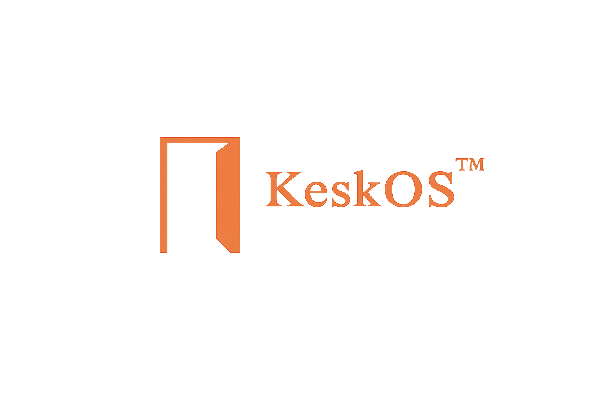

# KeskOS

<p align="center">
  
</p>

`keskos` is now a proper Arch-based live ISO project that boots into KDE Plasma and installs through Calamares.

The desktop keeps the same black/orange machine-console look the old script installer built toward:

- dark industrial Plasma surface
- orange accent `#ce6a35`
- centered `rofi` command layer
- Konsole profile with custom `fastfetch`
- Quickshell HUD
- matching SDDM, lock screen, and splash branding

The old script-based installer is preserved on a separate branch so none of that work was lost.

## Releases

Prebuilt ISOs are published manually when available:

- Releases: <https://github.com/memegeko/keskos/releases>

If the releases page is empty, build locally with `./build.sh`.

## Branches

`main`

- Archiso project
- Calamares GUI installer
- live KDE Plasma desktop
- system-wide `keskos` assets and post-install hooks

`legacy-script-installer`

- preserved script-based desktop installer
- original per-user setup flow

Switch between them with:

```bash
git checkout legacy-script-installer
```

and:

```bash
git checkout main
```

## What Main Does

The `main` branch builds a bootable Arch ISO that:

- boots into a `liveuser` KDE Plasma session
- autologins into the live desktop
- ships the KeskOS wallpaper, launcher, terminal theme, and branding
- exposes an `Install KeskOS` launcher and desktop shortcut
- runs Calamares as the primary installer
- applies KeskOS defaults to the installed system through post-install hooks

The installed system does not depend on the old legacy script.

## Build Requirements

Build on Arch Linux.

Install the required host-side tools:

```bash
sudo pacman -S --needed archiso pacman-contrib git base-devel curl python sudo grub syslinux
```

Notes:

- `archiso` provides `mkarchiso`
- `pacman-contrib` provides `repo-add`
- `base-devel` is needed because `build.sh` builds AUR packages
- `grub` provides `grub-install` for `uefi.grub`
- `syslinux` is required for the BIOS boot mode in the ISO profile
- `build.sh` creates a local pacman repo for `calamares` and `kdotool-bin`

## Build the ISO

```bash
chmod +x build.sh
./build.sh
```

What `build.sh` does:

- verifies you are on Arch Linux
- checks that required host tools exist
- creates `work/` and `out/`
- builds AUR packages into `work/localrepo/x86_64`
- generates a temporary pacman config that points at that local repo
- stages the Archiso profile into `work/profile`
- runs `mkarchiso`
- writes the finished ISO into `./out/`

The final ISO lands in:

```text
./out/
```

## Publishing a Release

`keskos` is currently released manually.

Typical flow:

```bash
git checkout main
git pull
./build.sh
```

After the ISO is built and tested, upload the finished image and checksum file from `./out/` to GitHub Releases manually.

## Test the ISO

### QEMU

Minimal test:

```bash
qemu-system-x86_64 \
  -enable-kvm \
  -m 4096 \
  -smp 4 \
  -cdrom out/*.iso \
  -boot d
```

If you want UEFI in QEMU, use your local OVMF setup.

### virt-manager

Recommended settings:

- 4 GB RAM or more
- 4 vCPUs if available
- UEFI firmware if you want to test the EFI path
- a 32 GB virtual disk or larger if you want to complete a real install

## Calamares Layout

Calamares is configured with a normal reliable flow:

- welcome
- locale
- keyboard
- partition
- users
- summary
- install
- finished

Key files:

- [calamares/settings.conf](calamares/settings.conf)
- [calamares/modules](calamares/modules)
- [calamares/branding/keskos](calamares/branding/keskos)

The branding is themed for KeskOS:

- black / charcoal background
- orange highlights
- VT323-style / monospace feel
- custom slideshow
- KeskOS logo and wallpaper

## Live Desktop Behavior

The live ISO boots into KDE Plasma and sets up:

- SDDM autologin for `liveuser`
- the KeskOS wallpaper
- the centered `rofi` launcher
- Quickshell HUD
- Konsole with the `KeskOS` profile
- the `Install KeskOS` desktop shortcut
- the `Install KeskOS` menu/launcher entry

The live user configuration is handled by:

- [airootfs/root/customize_airootfs.sh](airootfs/root/customize_airootfs.sh)
- [airootfs/usr/local/bin/keskos-configure-user](airootfs/usr/local/bin/keskos-configure-user)
- [airootfs/usr/local/bin/keskos-session-start](airootfs/usr/local/bin/keskos-session-start)

## Install-Time KeskOS Setup

After Calamares lays down the base system, KeskOS-specific finishing is handled by:

- [calamares/modules/postinstall.conf](calamares/modules/postinstall.conf)
- [airootfs/usr/local/bin/keskos-postinstall-root](airootfs/usr/local/bin/keskos-postinstall-root)

That post-install step:

- removes the live-only `liveuser`
- removes SDDM autologin for the live session
- rewrites `/etc/os-release` from `KeskOS Live` to installed `KeskOS`
- removes the live installer desktop shortcut
- applies user defaults for the created desktop user

## Where the Branding Lives

Main branding and desktop assets come from:

- [assets](assets)
- [configs](configs)
- [desktop](desktop)
- [launcher](launcher)
- [browser-home](browser-home)

ISO-specific branding lives in:

- [configs/sddm/keskos](configs/sddm/keskos)
- [configs/look-and-feel/com.keskos.desktop](configs/look-and-feel/com.keskos.desktop)
- [calamares/branding/keskos](calamares/branding/keskos)

## Modify Packages

Edit:

- [packages.x86_64](packages.x86_64) for live ISO packages
- [build.sh](build.sh) if you want to change AUR-built packages

Right now `build.sh` builds these AUR packages into the local repo:

- `calamares`
- `kdotool-bin`

If you change the package list, rebuild the ISO so the live image and installer stay in sync.

## Repo Layout

High-level layout:

```text
keskos/
├── airootfs/
├── assets/
├── browser-home/
├── build.sh
├── calamares/
├── configs/
├── desktop/
├── efiboot/
├── grub/
├── launcher/
├── packages.x86_64
├── pacman.conf
├── profiledef.sh
└── syslinux/
```

## Notes

- `build.sh` must be run as a normal user, not root
- it will call `sudo` only for the `mkarchiso` phase
- `work/` and `out/` are ignored in git
- the current build assumes a standard Arch host with network access so it can fetch AUR sources

## Legacy Script Installer

If you want the original script-driven setup back:

```bash
git checkout legacy-script-installer
```

That branch keeps the old installer state preserved under the commit:

```text
Preserve legacy script-based installer
```
